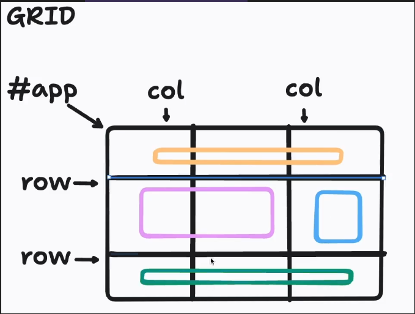

# Projeto
Nesse projeto da Rocktseat eu aprendi a utilizar o CSS GRID, no qual fiz uma pagina com demonstração de características de gálaxias. 


# GRID
- Colunas e linhas!

## Propriedades fundamentais
Todo Grid 'e composto de 2 princiapis grupos:
- Container -> o pai
- intens: o(s) filhos
### Display grid
Vai transformar os filhos como se fosse um bloco
### Display inline-grid
Mescla Inline-Grid, aceita alguns paramentros
### Grid-template-columns
- Serve pra gente criar colunas e com isso podemos definir o quanto queremos espacar, caso seja um valor fixo podemos usar
	- repeat (numero de col, medida das colunas)

## Grid template rows

- Rows no geral vai definir a altura

# Itens filho

## Grid Column

- Vai separar as colunas existentes de cada divisão

### Grid-column-start

- Define o parametro de inicio, normalmente começa com 1

### Grid- column-end

- Define o parametro que acaba
```
#app > * {
  border: 1px solid red;
}


#app header {
  grid-column-start: 1;
  grid-column-end: 4;
}

#app main {
  grid-column: 1/3;
}

#app footer {
  grid-column: 1/4;
}
```

## Grid row
- Vai mexer na visao das linhas
## Grid Template Areas
- Um jeito diferente de conseguirmos realizar o css grid
```
#app {

  display: grid;

  

  grid-template-areas:

  "header header header"

  "main main aside"

  "footer footer footer";

  

  height: 100vh;

  

}

  
  
  

#app header {

  grid-area: header;

}

  

#app main {

  grid-area: main;

}

  

#app aside {

  grid-area: aside;

}

  

#app footer {

  grid-area: footer;

}
```
## Gap
Posso aplicar o gap para dar distancia para os grids
### gap-column
Da o gap apenas para coluna
### gap-row
Da o gap para as linhas

## Grid template
- Versao reduzida de todo o grid css

# Introducao ao alinhamento do GRID

## Container
### Align-content
- Trabalha no eixo  Y, parte vertical do conteudo
### Justify-content
- Trabalha o alinhamento no eixo X
### place-content
- Trabalha o alinhamento do conteudo no eixo X e Y ao mesmo tempo
### Align-items
- Trabalha o eixo y
- vai deixar o tamanho da altura da letra
### Justify-Items
- Trabalha com o eixo x
### Place-items
- Mistura o Align e Justify, retirando largura e alturas

## Aplicado em items
- Serve para mexer em algum item especifico da GRID
### align-self
- Trabalha com o eixo X
### justify-self
- Trabalha com o eixo Y
### place-self
- Trabalha com os eixos X e Y

# Propriedades auto - raramente utilizadas
## grid-auto-flow
- Como padrao temos o padrão de linhas
- Ai podemos organizar por colunas quando precisamos
## grid-auto-rows
- Define o espaçamento das linhas caso o grid seja de linhas ou rows
## grid-auto-columns
- Deifne o espaçamento das colunas

# Grid ou Flex
- Depende de quando eu preciso utlizar
